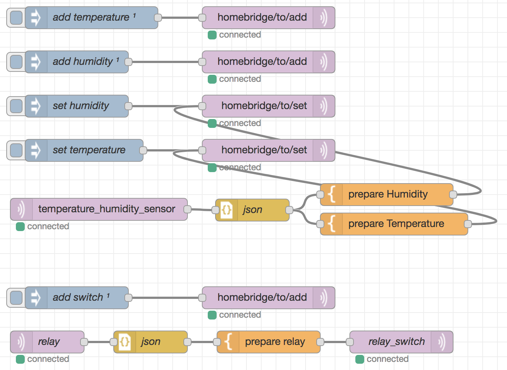

### Smarthome
___

### Nodered


### Settings nodered's flow
[here](example/flow1.json)

### Sketch (temperature+humidity+relay)
[here](example/example1.ino)

### Result


### x86_64
```bash
$ curl -O https://raw.githubusercontent.com/lafin/iot/master/docker-compose.yml
$ curl -O https://raw.githubusercontent.com/lafin/iot/master/docker-compose.x86_64.yml
$ docker-compose -f docker-compose.yml -f docker-compose.x86_64.yml pull
$ docker-compose -f docker-compose.yml -f docker-compose.x86_64.yml up
```

### armhf
```bash
$ curl -O https://raw.githubusercontent.com/lafin/iot/master/docker-compose.yml
$ curl -O https://raw.githubusercontent.com/lafin/iot/master/docker-compose.armhf.yml
$ docker-compose -f docker-compose.yml -f docker-compose.armhf.yml pull
$ docker-compose -f docker-compose.yml -f docker-compose.armhf.yml up
```