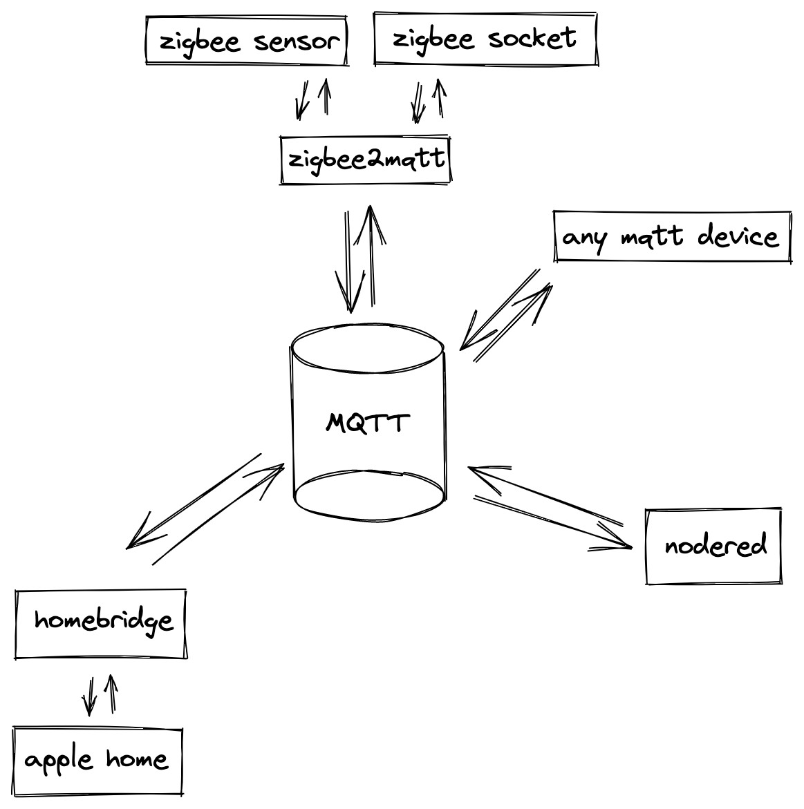
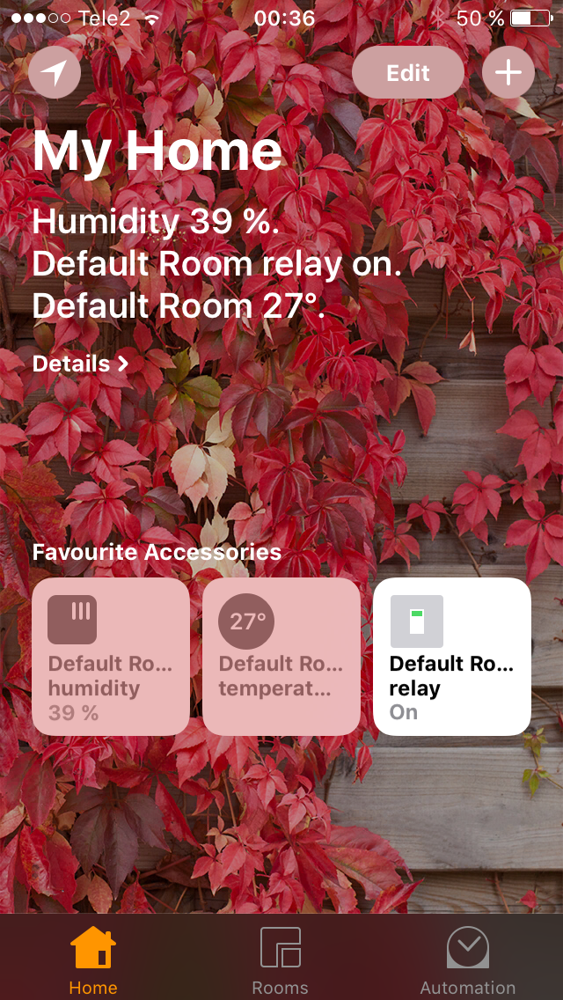

### Smarthome 
___

### How it works


### Nodered


### Result


### x86_64, armhf, arm64
```bash
$ mkdir -p homebridge nodered && \
  curl -O https://raw.githubusercontent.com/lafin/smarthome/master/docker-compose.yml && \
  curl -o homebridge/config.json https://raw.githubusercontent.com/lafin/smarthome/master/homebridge/config/config.json
$ docker-compose pull
$ TZ=Europe/Tallinn docker-compose up -d
```

### Zigbee
https://www.zigbee2mqtt.io/getting_started/what_do_i_need.html
```bash
$ cat zigbee/configuration.yaml
homeassistant: false
permit_join: true
mqtt:
  base_topic: zigbee2mqtt
  server: 'mqtt://localhost'
serial:
  port: /dev/ttyUSB0
advanced:
  log_level: debug
devices:
```

### Existed issues
- doesn't work on a Docker for MacOS [#issues/68](https://github.com/docker/for-mac/issues/68)